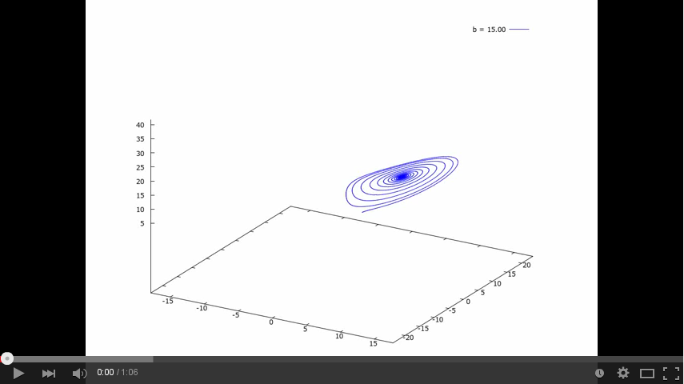

# Numerical Methods for ODEs

Methods used to find numerical approximations to the solutions
of ordinary differential equations (ODEs) implemented in C/C++.

- Integrates systems in any dimension.
- Calculations with float, double, long double...
- Any number of points.

## Runge Kutta 4th order

`rk4` folder. Template class `rk4` inside `rk4.h` file.

How to use `rk4` class: read `rk4/lorenz.cpp` or `rk4/rabinovich.cpp`.

> *Advice*: Runge Kutta Methods are solvers for non-stiff ODEs.

### Example: Lorenz Attractor

```bash
$ cd rk4
$ make lorenz
g++ -o bin/lorenz src/lorenz.cpp -std=c++11
$ bin/lorenz > test/lorenz.dat
$ gnuplot 
...
gnuplot> splot "test/lorenz.dat" using 2:3:4 with lines
```


### Example: Rabinovich–Fabrikant Attractor

```bash
$ cd rk4
$ make rabinovich
g++ -o bin/rabinovich src/rabinovich.cpp -std=c++11
$ bin/rabinovich > test/rabinovich.dat
$ gnuplot 
...
gnuplot> splot "test/rabinovich.dat" using 2:3:4 with lines
```


## [Boost](http://www.boost.org/) library

`boost` folder. There is no the boost library here, you need download
from [http://www.boost.org/users/download/](http://www.boost.org/users/download/).

[odeint](http://headmyshoulder.github.io/odeint-v2/) is part of the
boost library. [odeint](http://headmyshoulder.github.io/odeint-v2/)
is a moderm C++ library for numerically solving ordinary differential
equations. There are a lot of
[steppers](http://www.boost.org/doc/libs/1_55_0/libs/numeric/odeint/doc/html/boost_numeric_odeint/odeint_in_detail/steppers.html)
within [odeint](http://headmyshoulder.github.io/odeint-v2/), we used
runge_kutta_dopri5.

### Dependences

- [Boost library](http://www.boost.org/users/download/) >= 1.60.0
- [gnuplot](http://www.gnuplot.info/download.html) >= 4.6 (Try: `apt-get install gnuplot`)
- [gawk](http://ftp.gnu.org/gnu/gawk/) (Try: `apt-get install gawk`)
- [avconv](https://libav.org/download/) (Try: `apt-get install libav-tools`)

### Example: Chaotic values for parameters in Lorenz Attractor

```bash
cd boost
make
make test
mplayer test/test.mp4
```

You can see the result:

[](https://www.youtube.com/watch?v=VctMFmKfU14)